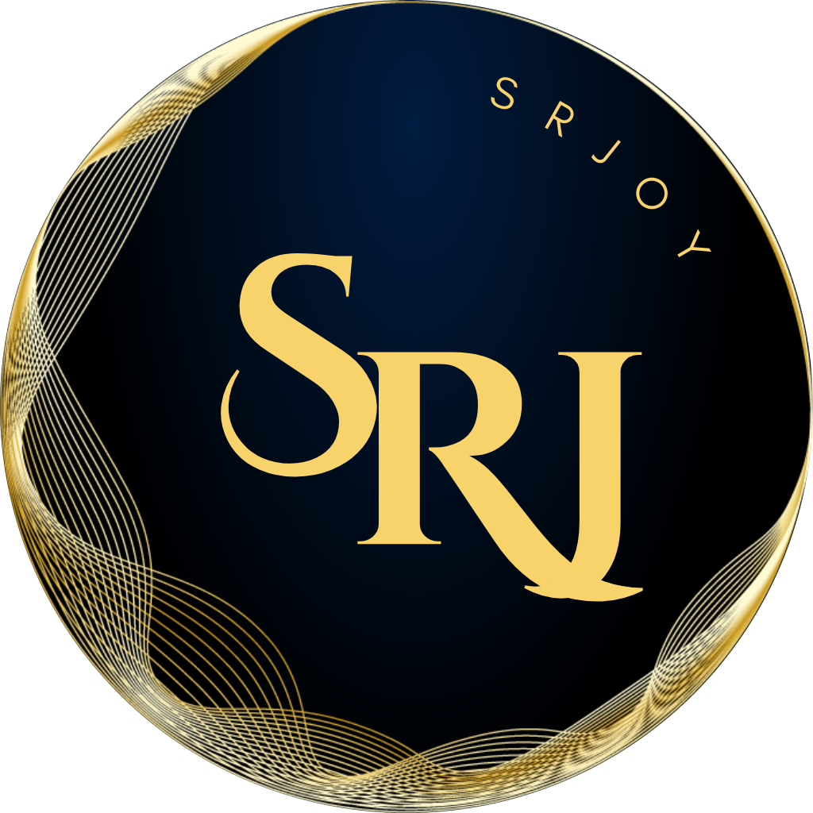
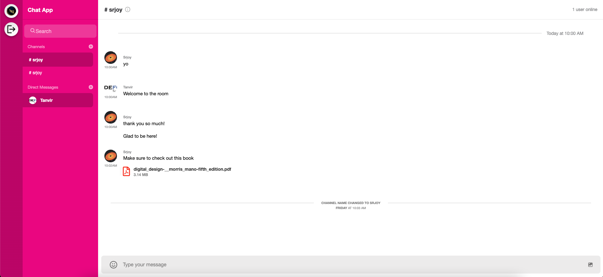
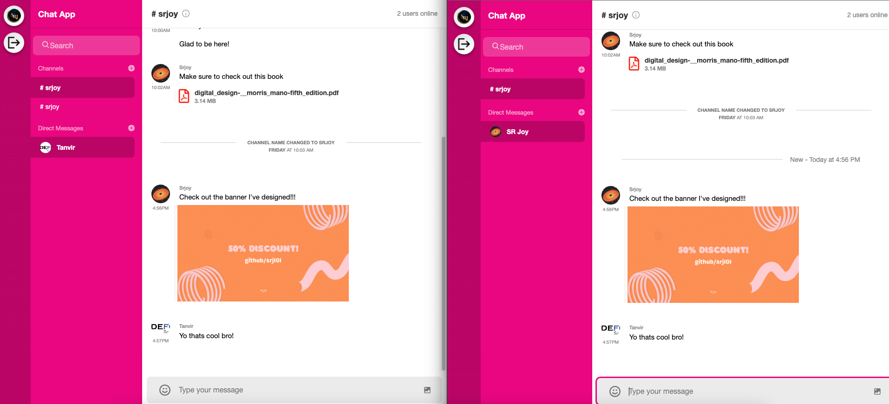

<!-- PROJECT LOGO -->
 

  
  <h3 align="center">Full Featured Chatting Application</h3>

## 🆕 Getting Started

- ### **Prerequisites**

  - [Stream Chat](https://getstream.io/)
  - [React](https://reactjs.org/)
  - [Node JS Server](https://nodejs.org/)

<!-- GETTING STARTED -->

- ### **Installation**

  Install: cd /client & /server and run `npm install`!

  Run Project Locally: `npm start` on both server and client

<!-- SCREENSHORTS -->

## 🔥 Screenshots

  

  

## 🌟 Show your support

Give a ⭐️ if this project inspires you!

## 📝 License

Copyright © 2022

<!-- CONTACT -->

## 👤 Contact

| **SR JOY**                                          |
| --------------------------------------------------- |
| - Facebook: [@srjoy01](https://facebook.com/srj101) |
